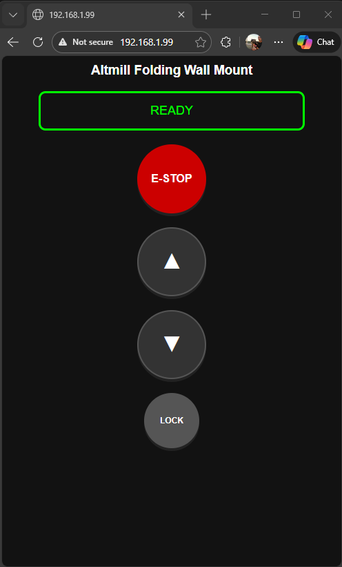

# ESP32-S3 Stepper Web Control (WIP)

A secure, web-based industrial "pendant" interface for controlling a dual-motor axis using an ESP32-S3. This project features a responsive "Press-to-Run" UI, multi-color LED status feedback, and hardware safety interrupts.

## Features
- **Dual Motor Sync:** Steppers move in unison on dedicated pins to prevent hardware strain.
- **Press-to-Run UI:** Real-time movement control via web browser (Mobile Optimized).
- **Physical Overrides:** Support for hardware Up/Down buttons and an Emergency Stop.
- **Visual Feedback:** WS2812 RGB LED color-coding:
  - 🔵 **Blue**: Moving Up
  - 🟡 **Yellow**: Moving Down
  - 🟢 **Green**: System Ready
  - 🔴 **Red**: System Disabled (E-Stop)
- **Security:** HTTP Basic Authentication and a 5-minute inactivity timeout.

## Hardware Required
- **MCU:** [Lonely Binary ESP32-S3 Gold Edition](https://www.lonelybinary.com) - [Amazon](https://www.amazon.com/dp/B0FL149DGM?ref=fed_asin_title)
- **Drivers:** 2x Stepper Drivers 1.0-4.2A 20-50VDC - [Amazon](https://www.amazon.com/dp/B06Y5VPSFN?ref=fed_asin_title)
- **Motors:** 2x NEMA 23 (or similar) - [Amazon](https://www.amazon.com/dp/B091C37FJ2?ref=fed_asin_title)
- **Buttons:** 3x Momentary Buttons (Up, Down, E-Stop) - [Amazon](https://www.amazon.com/gp/product/B07S9MCKX8?ref=ppx_pt2_dt_b_prod_image)

## Pinout Reference
| Component | GPIO | Function |
| :--- | :--- | :--- |
| **Motor 1 STEP** | 6 | Pulse Signal |
| **Motor 1 DIR** | 7 | Direction Signal |
| **Motor 2 STEP** | 8 | Pulse Signal |
| **Motor 2 DIR** | 9 | Direction Signal |
| **Button UP** | 13 | Physical Move Up |
| **Button DOWN** | 14 | Physical Move Down |
| **E-STOP** | 15 | System Kill Switch |
| **Onboard LED** | 48 | WS2812 RGB |

## Installation & Setup

1. **Libraries:** Install the following in the Arduino IDE:
   - `AccelStepper`
   - `Adafruit NeoPixel`

2. **Credentials:** - Rename `secrets_template.h` to `secrets.h`.
   - Enter your WiFi SSID, Password, and desired Web Credentials.
   - **Note:** `secrets.h` is ignored by Git to keep your network safe.

3. **Board Settings:**
   - Board: `ESP32S3 Dev Module`
   - USB CDC On Boot: `Enabled` (Crucial for Serial Monitor)
   - Flash Mode: `QIO 80MHz`

4. **Usage:**
   - Flash the code and open the Serial Monitor (115200 baud).
   - Find the IP address printed on the screen.
   - Navigate to the IP on your browser and log in.

## Security
This project uses **Basic Access Authentication**. To avoid exposing your credentials on GitHub, ensure your `secrets.h` file is listed in your `.gitignore`.