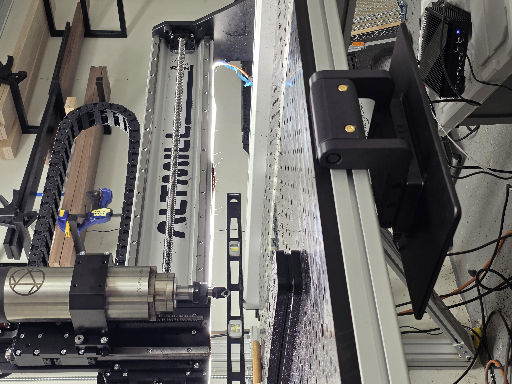
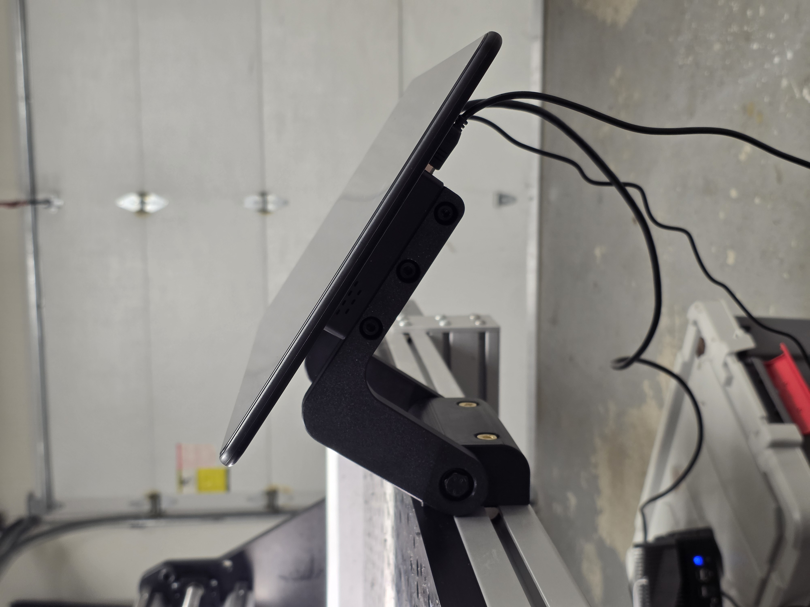
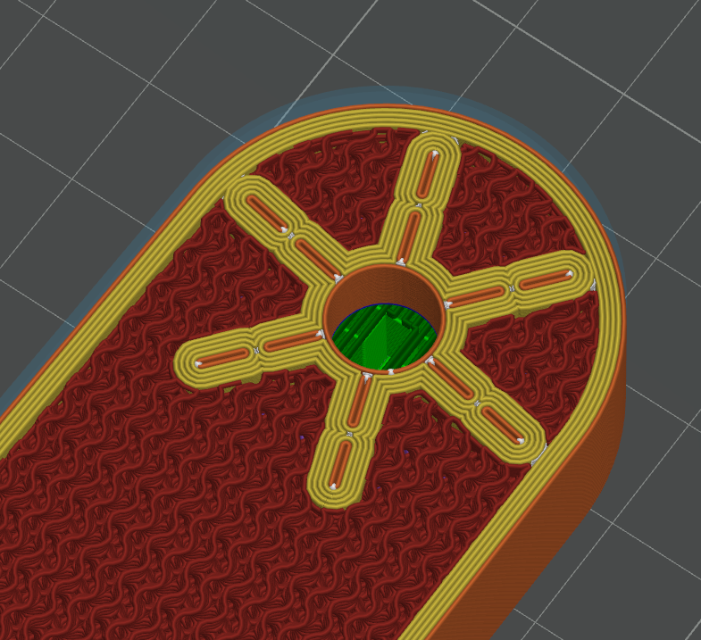

# Front Pivoting Touchscreen Mount

|  folded  |  extended |
| --- | --- |
|  |   |

## Parts Needed
1. 1x M8 150mm bolt - [Amazon](https://www.amazon.com/dp/B0FFXKZLWW?ref=fed_asin_title&th=1).
2. 6x brass heatset M6 nuts - [Amazon](https://www.amazon.com/Kadrick-Threaded-Inserts-Printing-Components/dp/B0D5QK7YGQ/ref=sr_1_10?crid=NYQQXJBSHZRT&dib=eyJ2IjoiMSJ9.3I0l3ic4O09ZRQauSYBEbT2DxwZRTnvryOIi0czUysR5yZI9lmKUyTTlDMmlFNP_E22IJ0N3ULtSVd2TBTVqK17y0HiHkE5hb7PEwoO1HA3kV73V8Gv9ckQeifJ38B_acSFL_uMatGhKJ7xxErrFbjoQdwOlU-rypS4K7LaX7ynySS72b937LcyGujqiDt8UuVVCd8BKFi045hqQS5MAqmcpBfBi-HLIwOH60J1sVqZzqU8vvkcJmQFpMQd9cbY0imHM6F8LTmRAlhdacSGYUYFUOX3NhbPBsc9fKH33T1A.h3PF_47Tm3qxtqM03nqcSRtTed7h_G98NUi2aVlCKJc&dib_tag=se&keywords=m6%2Bheatset%2Binsert&qid=1769639533&s=industrial&sprefix=m6%2Bheatset%2Binser%2Caps%2C172&sr=1-10&th=1)
3. 6x M6 20mm bolts - [Amazon](https://www.amazon.com/dp/B0D78N7H18?ref=fed_asin_title&th=1)
4. 4x M4 12mm bolts - [Amazon](https://www.amazon.com/M4-0-70-Button-Stainless-Fullerkreg-Plastic/dp/B07H17YKW1/ref=sr_1_1_sspa?crid=2L3T77FOOLFSL&dib=eyJ2IjoiMSJ9.LS5g4r0WaNnnw7wRsKZYrQgTY0OX-5nUFxnmW6gTjvQ1Qb5kLmjPfjwCQ3BmeRwW5N1amzw6Tg3ntf2fPEEdXiZQy376t9t66G5i3C-nNZ2Oq0eEQkcGuK0aH-UmMxKcPTpalzYYlnU6S7gnC0VvNZ5QnmCuLLR0z6w8VSq89ro2Aicx7XeQBiiXE7HYoGt-JjxVwOgO9Bb89NH_so-49ro7Wjg-mpScNhnAmFrok6442hepZ1VBozOoY6BGyhpSnjGmm5oh3gcKENgueIoWULOf-_mOyYMJsBUWAPON1vc.JRJFjDdSQA17WcX5UjHaIZv07bTP-aZQErS4FdLpp9I&dib_tag=se&keywords=m4%2B12mm&qid=1769639779&s=industrial&sprefix=m4%2B12mm%2Caps%2C182&sr=1-1-spons&sp_csd=d2lkZ2V0TmFtZT1zcF9hdGY&th=1)
5. 75mm VESA mounted touchscreen - [Amazon](https://www.amazon.com/dp/B0DB7G1TW4?ref=fed_asin_title)

## Printing Tips

- Print with your favorite filament (ASA used here). 
- Use 5 wall loops, 8 top and bottom layers, 30% infill. 
- Arm needs to be mirrored for the second one. 

## Altmill Aluminum Extrusion Issues

The Altmill uses almost standard 45mm extrusions but I have yet to find any nuts that can be inserted from the front. To add M8 nuts in the extrusion you'll ether have to widen the slot in (preferbally in a hidden location like behind the mount) or dissamble one side of the front extrusion. 